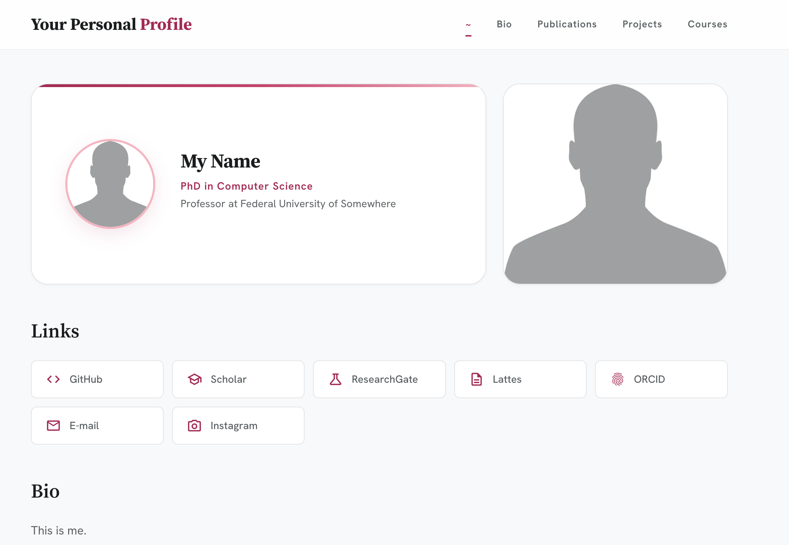

# Academic Profile — a Simple Static SPA

A fully static, single-page academic profile site. No build step, no backend, no framework — just HTML, CSS, and vanilla JavaScript served directly from any static host.



---

## Project Structure

```
profile/
├── index.html              # Main shell (navbar, footer, auth modal)
├── config.md               # Site configuration (menu, footer, protected password)
├── css/
│   └── style.css           # All styles
├── js/
│   └── app.js              # SPA logic (routing, rendering, BibTeX parsing)
├── pages/                  # Markdown content pages
│   ├── profile.md           # Home / profile page
│   ├── page.md
│   └── protected/          # Password-protected pages
│       └── private_page.md
├── bib/                    # Publications
│   ├── _index.md           # Lists .bib files and GitHub source links
│   ├── publications.bib    # BibTeX entries
│   ├── pdf/                # PDFs named by citation key (e.g. sample.pdf)
│   └── slides/             # Slides named by citation key (e.g. sample.pdf)
├── img/                    # Images (avatar, logo, hero)
├── deploy.sh               # FTP deploy script (lftp)
├── ftp_config.json         # FTP credentials (keep private, never commit)
└── .htaccess               # Apache config (GZIP, caching, MIME types)
```

---

## How It Works

The app is a **SPA (Single Page Application)** driven by `js/app.js`:

1. On load, `config.md` is fetched and parsed to build the navbar, footer, and read the protected-page hash.
2. Clicking a menu item fetches the corresponding `.md` file and renders it into `#page-content` using [marked.js](https://marked.js.org/).
3. The **Publications** menu item reads `bib/_index.md` to discover `.bib` files, parses them client-side, and renders a grouped, year-sorted publication list with PDF/Slides/DOI/Code links.
4. Internal `.md` links (e.g. `[Talk](pages/talk.md)`) are intercepted and loaded within the SPA without a full page reload.
5. The browser's **back/forward** buttons work via the History API (`pushState` / `popstate`).
6. Pages inside `pages/protected/` are gated by a **client-side password check** (SHA-256 hash stored in `config.md`).

---

## Configuration — `config.md`

All site-level settings live here. No code changes needed for typical customization.

```markdown
# Configuratios

## site
- title: Your Personal Profile
- subtitle: Researcher

## menu
- ~ | person | pages/profile.md
- Bio | person | pages/bio.md
- Publications | menu_book | bib/
- Projects | terminal | pages/projects.md
- Courses | school | pages/courses.md

## protected
- hash: <sha256-of-your-password>        # Leave empty to disable protection

## footer
- Google Scholar | https://scholar.google.com/citations?user=XXXX
- GitHub | https://github.com/youruser
```

Icons use [Material Symbols](https://fonts.google.com/icons) names (e.g. `person`, `menu_book`, `school`).

---

## Editing Content

### Pages

Each menu item maps to a `.md` file. Edit it with standard Markdown. HTML is also supported (e.g. for profile cards or `topic-card` divs).

**Internal links** between pages use relative paths:
```markdown
[Introduction to Data Mining](pages/intro_dm.md)
```

**Research topic cards** (description + student list):
```markdown
<div class="topic-card">

Description of the research topic here.

- Student Name (year): Thesis title

</div>
```
> Leave a blank line after `<div class="topic-card">` and before `</div>` for markdown to render correctly inside.

### Publications

1. Add BibTeX entries to `bib/publications.bib`.
2. List the file in `bib/_index.md`:
   ```markdown
   - publications.bib
   ```
3. **PDF / Slides** are auto-discovered by citation key filename:
   - `bib/pdf/sample.pdf` → PDF button
   - `bib/slides/sample.pdf` → Slides button
4. **GitHub links** per citation key go in the `## sources` section of `bib/_index.md`:
   ```markdown
   ## sources
   - sample | https://github.com/ttportela/profile
   ```

### Protected Pages

Any `.md` file inside `pages/protected/` requires a password to view.

To set or change the password:
```bash
echo -n "yourpassword" | shasum -a 256 | awk '{print $1}'
```
Paste the hash into `config.md` under `## protected`:
```markdown
## protected
- hash: <paste-hash-here>
```

The password is verified client-side using `crypto.subtle` (SHA-256). The session is in-memory only — refreshing the page requires re-entering the password.

---

## Running Locally

No build step required. You only need a local HTTP server (browsers block `fetch()` on `file://`).

**Option A — Python (recommended):**
```bash
cd profile/
python3 -m http.server 8080
```
Then open [http://localhost:8080](http://localhost:8080).

**Option B — Node.js (`npx`):**
```bash
npx serve tarlis/
```

**Option C — VS Code:**
Install the [Live Server](https://marketplace.visualstudio.com/items?itemName=ritwickdey.LiveServer) extension and click **Go Live** from `index.html`.

---

## Deploying to Hostgator (FTP)

The project uses `lftp` for incremental FTP uploads — only modified files are sent.

### Prerequisites

```bash
brew install lftp       # macOS
# or
sudo apt install lftp   # Debian/Ubuntu
```

### Configure credentials

Edit `ftp_config.json` with your Hostgator FTP details:
```json
{
  "host": "ftp.yourdomain.com",
  "port": 21,
  "username": "ftp-user@yourdomain.com",
  "password": "yourpassword",
  "secure_ftps": true,
  "passive_mode": true,
  "timeout_sec": 30
}
```

> ⚠️ **Never commit `ftp_config.json` to a public repository.** Add it to `.gitignore`.

### Run deploy

```bash
chmod +x deploy.sh
./deploy.sh
```

The script:
- Reads credentials from `ftp_config.json`
- Mirrors the local folder to the FTP root using `lftp mirror --reverse --only-newer`
- Skips: `.git/`, `design/`, `_private/`, `ftp_config.json`, `deploy.sh`, `.DS_Store`

---

## Customization Reference

| What | Where |
|---|---|
| Site title & subtitle | `config.md` → `## site` |
| Navigation menu | `config.md` → `## menu` |
| Footer links | `config.md` → `## footer` |
| Protected page password | `config.md` → `## protected` |
| Profile card | `pages/profile.md` |
| Publications | `bib/publications.bib` |
| Styles & colors | `css/style.css` (CSS variables at top) |
| Primary color | `--primary: #b01851` in `css/style.css` |
